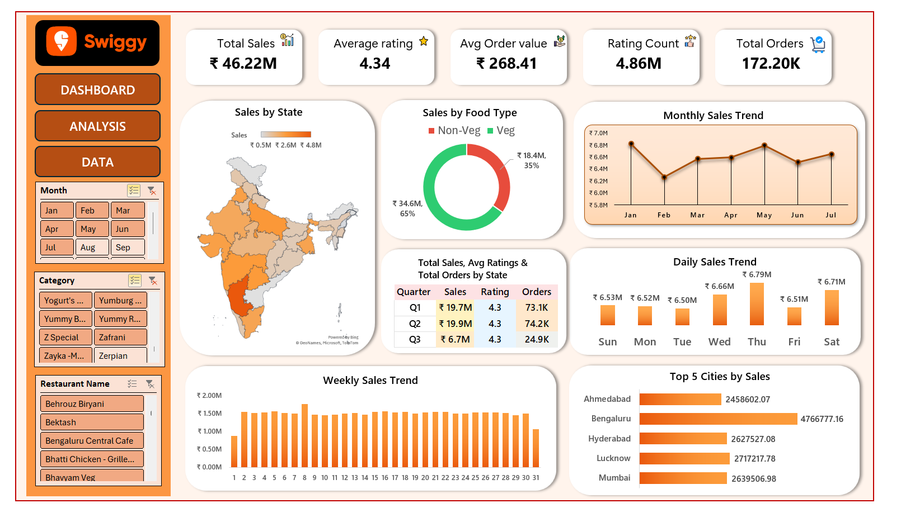
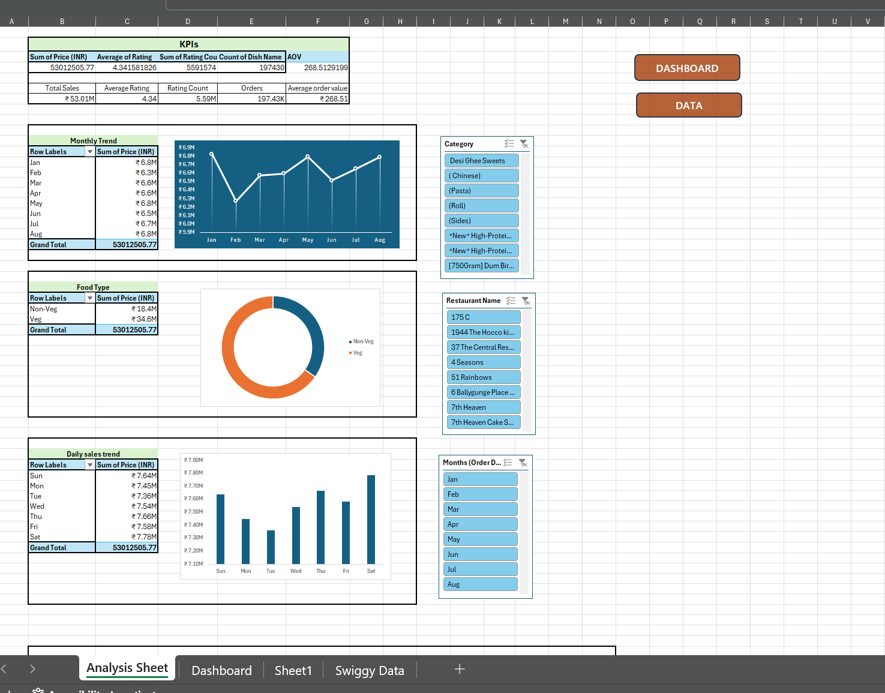

# Swiggy Sales Performance Dashboard (Excel)

## 📌 Project Overview

The **Swiggy Sales Performance Dashboard** is an interactive Excel report designed to **turn complex sales data into actionable business insights**.  

This dashboard allows stakeholders to **quickly understand sales trends, customer behavior, and regional performance**, enabling **data-driven decisions** that can improve revenue, customer satisfaction, and operational efficiency.  

Key highlights include:
- **Trend Analysis**: Visualize daily, weekly, monthly, and quarterly sales patterns.  
- **Customer Insights**: Compare Veg vs Non-Veg sales and analyze ratings to measure satisfaction.  
- **Regional Performance**: Identify top-performing states and cities using maps and charts.  
- **Interactivity**: Use slicers to filter and explore data dynamically across time periods and categories.  

This project demonstrates **end-to-end data analytics skills**: from cleaning and organizing raw transactional data to designing a visually engaging and interactive dashboard that communicates insights clearly for business stakeholders.

### 🖥️ Dashboard Overview

The main dashboard displays important KPIs and visualizations, allowing users to **interactively explore sales performance, customer preferences, and regional insights**.

The dashboard enables users to:
- Monitor overall sales and order performance
- Identify trends across time (daily, weekly, monthly, quarterly)
- Compare Veg vs Non-Veg sales contribution
- Analyze regional performance using state-wise sales mapping
- Identify top-performing cities

All visuals are interconnected, allowing users to interact with the data dynamically.

*Interactive dashboard showing total sales, average ratings, total orders, and Veg vs Non-Veg sales.*

### 📊 Analysis & Calculations

Before creating the dashboard, the following analysis steps were performed to **prepare and understand the data**:

*KPI calculations for Average Order Value, Ratings, and Ratings Count.*

*Pivot table showing total sales and total orders by state.*

*Charts showing daily and monthly sales trends, used to identify patterns and business insights.*

## 📌 Business Problem

Swiggy, like any large food delivery platform, handles **millions of orders across multiple cities and states**.  
With such vast data, it becomes challenging for business stakeholders to:

- Track overall sales and revenue trends efficiently.  
- Understand customer preferences, such as Veg vs Non-Veg orders.  
- Monitor performance across states, cities, and time periods.  
- Quickly identify high-performing regions or areas needing attention.  

Without a clear visualization tool, **key insights are buried in raw transactional data**, making decision-making slow and prone to errors.  

## 🎯 Objectives

The main objectives of this dashboard project were to:

1. **Provide a centralized view of sales performance** over time (daily, weekly, monthly, and quarterly).  
2. **Highlight customer behavior and satisfaction** through ratings and order value metrics.  
3. **Enable regional analysis** to identify top-performing states and cities.  
4. **Create an interactive tool** with slicers and filters for dynamic exploration of data.  
5. **Transform raw data into actionable business insights** that support data-driven decision-making.  

### 📊 Key Performance Indicators (KPIs)

The dashboard highlights the following core metrics to provide a quick business overview:

- **Total Sales** – Total revenue generated from food orders.  
- **Total Orders** – Number of orders received, showing customer activity.  
- **Average Order Value (AOV)** – Revenue per order, useful for identifying high-value customers.  
- **Average Rating** – Customer satisfaction across restaurants.  
- **Ratings Count** – Number of reviews, showing engagement and feedback volume.

> These KPIs are displayed as **interactive cards on the main dashboard**, allowing stakeholders to quickly assess overall business performance.

## 🛠 Tools & Techniques Used

- **Microsoft Excel** – Dashboard creation and visualization
- **Pivot Tables & Pivot Charts** – Data aggregation and analysis
- **Excel Formulas** – KPI calculations and quarter derivation
- **Conditional Formatting** – Visual emphasis on performance metrics
- **Slicers & Filters** – Interactive data exploration

## 📚 Key Learnings

- Learned how to convert raw transactional data into meaningful insights
- Gained hands-on experience in designing interactive Excel dashboards
- Improved understanding of business KPIs and performance tracking
- Learned how to structure and present analytics projects professionally

## 🚀 Conclusion

This project demonstrates the practical application of Excel for business analytics by transforming raw Swiggy sales data into an interactive decision-support dashboard. 

Future enhancements may include:
- Automating data refresh
- Adding advanced trend forecasting
- Migrating the dashboard to Power BI for enhanced scalability
